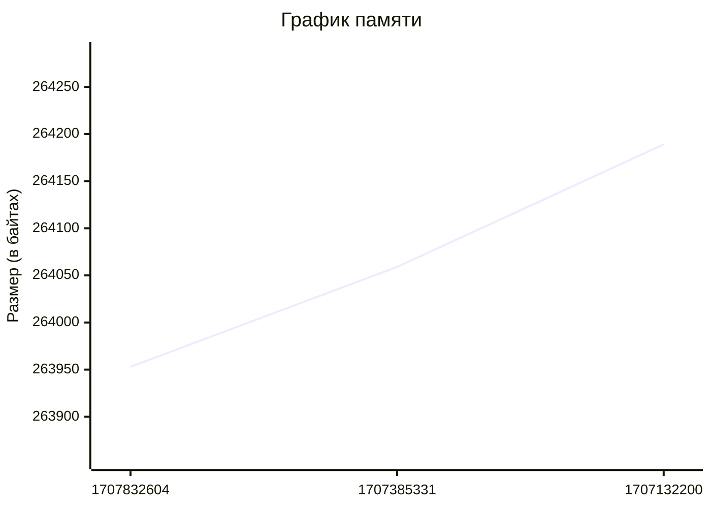

# size-upload

Экшон добавляет статистику из size-limit в файлы csv на s3

### Использование
Мы хотим знать какой у нас получался размер бандла при каждом запуске CI на нашей ветке. Экшон будет хранить размер бандла для каждого коммита на котором экшон запускался.
```yml
name: Upload size

run-name: Upload size on ${{ github.ref_name }} branch

on:
  push:
    branches:
      - master

jobs:
  upload_size:
    steps:
      - name: Checkout
        uses: actions/checkout@v5

      - name: Setup NodeJS
        uses: actions/setup-node@v4

      - name: Build
        run: yarn build

      - name: Get size
        run: npx size-limit --json > size.json

      - name: Upload size on s3
        uses: VKCOM/gh-actions/VKUI/s3@main
        with:
          awsAccessKeyId: ${{ secrets.AWS_ACCESS_KEY_ID }}
          awsSecretAccessKey: ${{ secrets.AWS_SECRET_KEY }}
          awsBucket: ${{ vars.AWS_BUCKET }}
          awsEndpoint: https://${{ vars.AWS_ENDPOINT }}
          awsKeyPrefix: size-limit/${{ github.ref_name }}/
          sizePath: size.json
```

Экшон загружает `list.json` со списком csv файлов

Пример:

```json
{
  "JS": {
    "filename": "2957772e-40c2-4816-aa9d-16c65b57dfc1.csv"
  },
  "JS (gzip)": {
    "filename": "430c9be1-6538-474c-bd93-038c8c3e8875.csv"
  },
  "JS (brotli)": {
    "filename": "27e30fe2-a221-412a-a0cf-f748d6ae0d75.csv"
  },
  "JS import Div (tree shaking)": {
    "filename": "3fd487ab-7908-4cca-bdb1-fa2d8c01a95c.csv"
  }
}
```

csv файлы имеют следующие заголовки:

- `hash` - хэш коммита
- `timestamp` - время в формате unixtime
- `size` - размер бандла в байтах

Пример:

```csv
hash,timestamp,size
7bbbfd02691e97d7da3badecaf5119da3cf485a9,1707832604,263953
edecd303c4f00156032034ab17f38715a1e879e3,1707385331,264059
7a40f534ddfbeabb0fdf6c5f8f078005a2d20c2e,1707132200,264189
```


